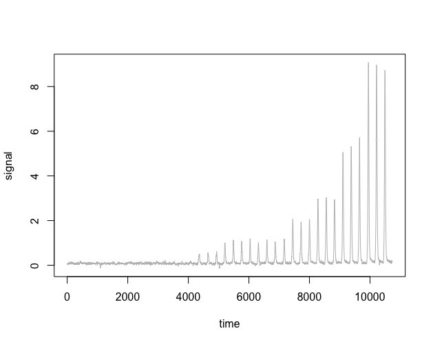
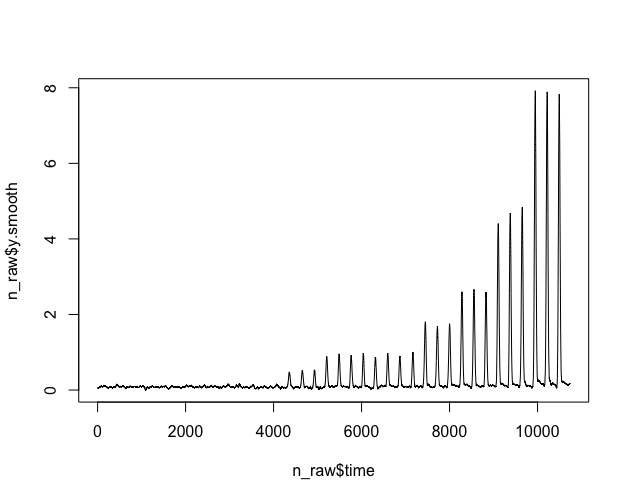
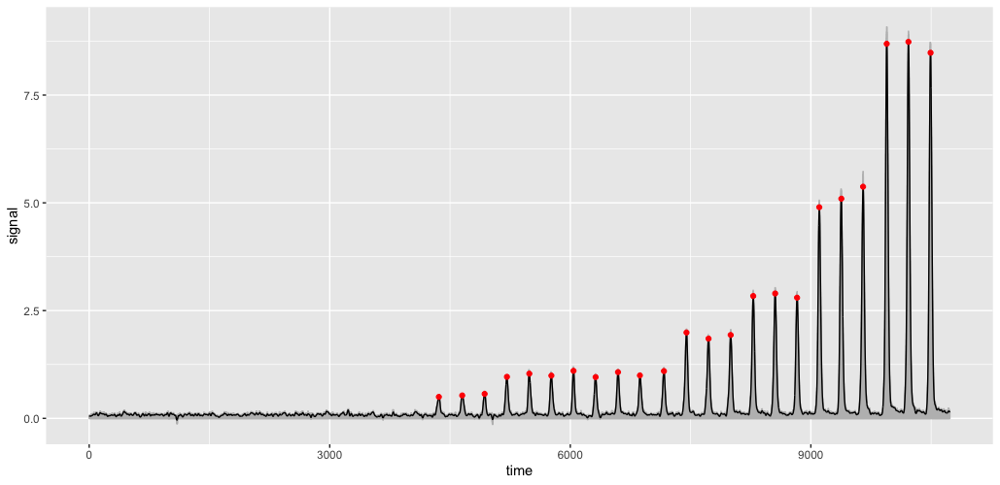
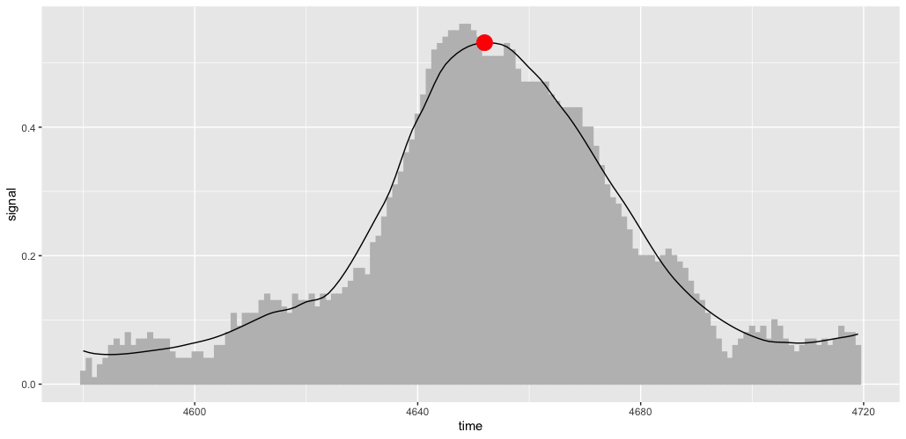

# Peak picking algorithm to handle thermalox data

## Rationale

The purpose of this exercise is to take a manually extracted `xy` trace from the themalox detector monitoring window, identify expected peaks, and output their areas. Steps involved:

1. Import data
2. Smooth using a `loess` function
3. Identify peaks using `{pracma::findpeaks}`
4. Calculate area under peaks using `{DescTools::AUC}`
5. Output table containing (at least) peak time and area


## Methods
### Importing data
Data can be simply imported using `read_csv`, assuming initial Excel fiddling has been done to provide a clean two-colun `.csv` file with headers. Once imported, it's worth plotting to see that everything is OK, e.g. `plot(n_raw, col = 'Gray', type = 'l')`


### Smoothing data
As noise will make peak identification difficult, a mild smoothing is done using a locally-weighted regression: `n_raw$y.smooth <- loess(n_raw$signal ~ n_raw$time, span=0.005)$fitted`, which is again plotted to check the span parameter is optimised and has not created any artefacts: `plot(n_raw$time, n_raw$y.smooth, type = 'l')`


### Finding peaks
There are a few different ways to do this, but `{pracma}`'s `findpeaks` function appears to work well after testing on a large and small peak from a thermalox dataset. With a bit of googling, a starting solution that builds a new df containing information about the peaks is gained using the following code:

```
peaks <- data.frame(findpeaks(n_raw$y.smooth, 
                              npeaks=23, 
                              threshold=0, 
                              peakpat = "[+]{1,}[0]*[-]{1,}", 
                              sortstr=TRUE))
```
It is important to specify the number of peaks being searched for. If lots of noise is being picked up and smoothing isn't working, the `threshold` option can be played with.

This `peaks` df will be useful later. Its columns are defined as:

* X1 = height at point of picking
* X2 = time at point of picking
* X3 = time at start of peak
* X4 = time at end of peak


Once that's done, we need to add an index column to merge on: 

``` 
n_raw$n <- seq(1,length(y.smooth))
```
Once that's done, we merge the two together
```
merged <- merge(x=n_raw, 
               y=peaks, 
               by.x="n", 
               by.y="X2", 
               all.x=TRUE, 
               all.y=TRUE)
```

This is all very non-tidyverse, but works well enough. `merge` is a command I want to take a look at more closely later on. Clearly it's a `{tidyverse}` `full_join` analogue in base R.

We can now plot the outcomes of this exercise in `{ggplot}`:

```
ggplot(merged, aes(x=time, y=signal)) +
  geom_col(orientation="x", colour = "grey") +
  geom_line(aes(x=time, y=y.smooth))+
  geom_point(aes(x=time, y=X1), colour = "red")
```
This shows the raw data as the grey histogram, the smoothed data as the line, and the tips of each identified peak on the smoothed data as the red spot.


To check how well the smoothing and centring has worked, it's worth zooming in on a couple of peaks. First produce a trimmed df that brackets just one peak by manually specifying teh slice based upon the parameters for the desired peak in the `peaks` df:

```
trim <- merged %>% slice(4581:4720)
```
Then, once that's done, this sliced data can also be plotted and studied:

```
ggplot(trim, aes(x=time, y=signal)) +
  geom_col(orientation="x", colour = "grey", fill = "grey") +
  geom_line(aes(x=time, y=y.smooth))+
  geom_point(aes(x=time, y=X1), colour = "red")
```


The above seem a pretty reasonable compromise on noise and full coverage. Manual checking of a few peaks showed apparent consistency. So, it's time to move on.

### Quantifying areas

